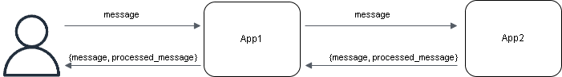
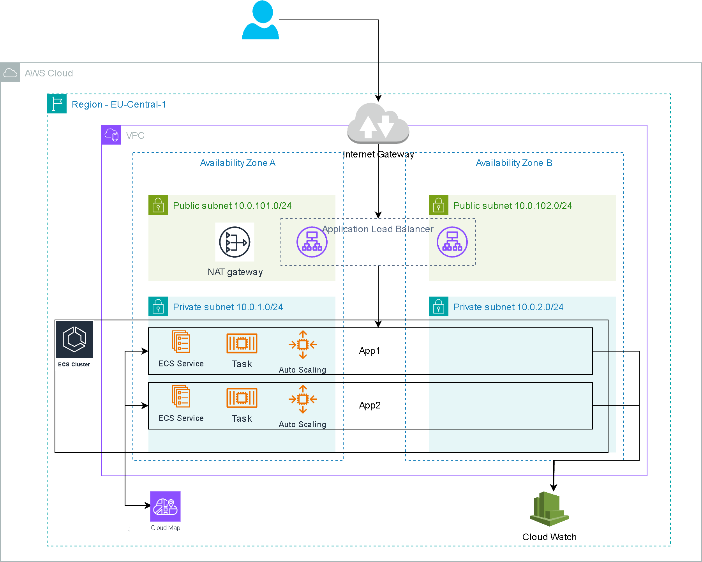
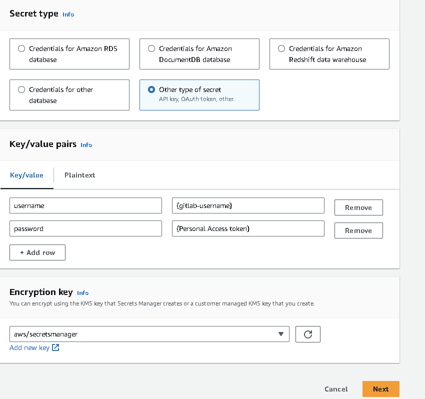
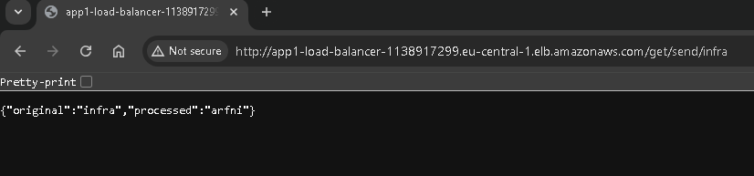
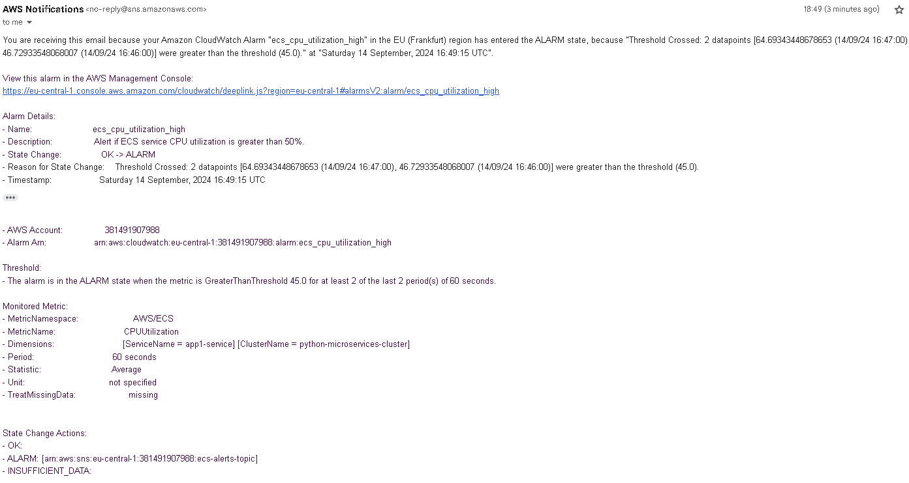
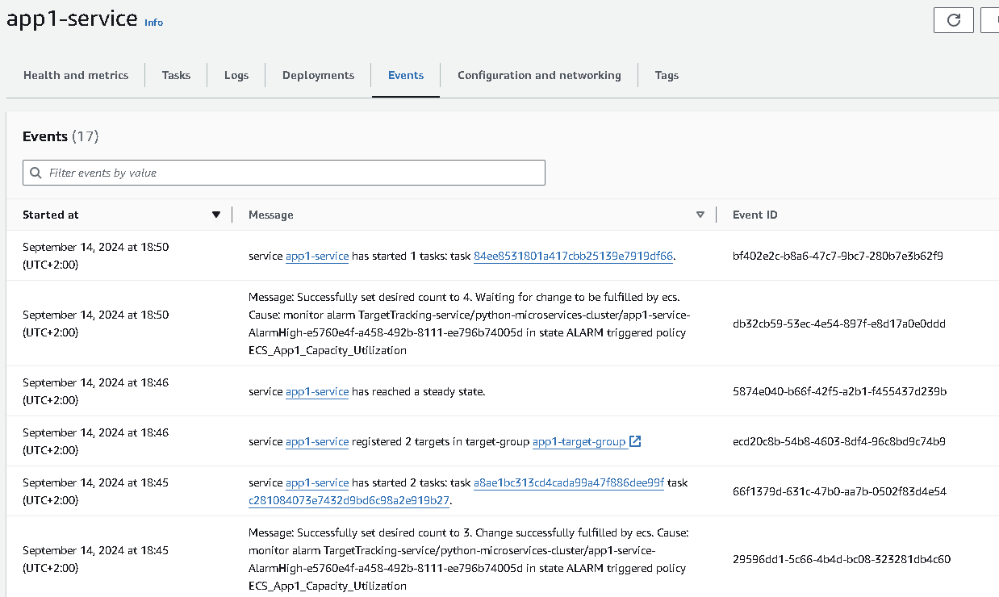

# PythonMicroservicesAWS
A Python-based microservices project deployed on AWS using ECS and Terraform.

## Table of Contents
1. [Introduction](#introduction)
2. [Features](#features)
3. [Infrastructure Overview](#infrastructure-overview)
4. [Deployment Process](#deployment-process)

## Introduction
This repository contains two microservices built using Python FastAPI and deployed on AWS ECS. The infrastructure is managed using Terraform, and Docker is used to containerize the services.
- App1 is a RESTful API that receives a user-provided message, sends this message to App2, and then returns both the original and the processed message.
- App2 reverses the input text and returns both the original and modified messages.



## Features
- **Microservices**: FastAPI-based services (App1 and App2).
- **Docker**: Containerization for efficient deployment.
- **GitLab CI/CD**: To automate the building and pushing of Docker images.
- **AWS**: Deployed in AWS cloud
- **Terraform**: Infrastructure-as-Code for deployment automation.

## Infrastructure Overview


The infrastructure is set up using AWS and Terraform. The following services are leveraged:
- **VPC** : AWS Virtual Private Cloud (VPC) enables users to launch AWS resources in a logically isolated virtual network. The VPC has a private and a public subnet in two of the Availability Zones in the Region. An internet gateway to allow communication between the resources in the VPC and the internet. A single NAT gateway to allow instances in private subnet to communicate with internet. 
- **AWS ECS (Elastic Container Service)**: For managing and deploying containers using ECS. ECS Services, Task Definitions, and Auto-Scaling has been defined for both the apps.
- **CloudMap**: CloudMap is a Service Discovery service enables service instances to be registered and discovered within a virtual private cloud. It handles inter-service communication.
- **CloudWatch**: The ECS tasks for both App1 and App2 are configured to log their activities to AWS CloudWatch.
- **Application Load Balancer**:  The Application Load Balancer routes external HTTP requests to the ECS tasks running the App1 microservice.

## Deployment Process
### Prequisites
- Docker
- AWS CLI: Logged into an AWS Account
- Terraform

### Walkthrough

#### 1. Creation of Python microservices
1. Created [App1](app1) and [App2](app2) using fastAPI, httpx and uvicorn modules. 
3. Created requirements.txt and Dockerfile files for both microservices.
4. Built docker images.
4. Created docker-compose.yml file to test the microservices.
5. Run in this directory to build and run the apps:
```
docker compose up
```
The `app1` will be running at http://localhost:8000 and the app2 will be at http://localhost:8001

Example usage: 
Requests can be sent to app1 as http://localhost:8000/get/send/hello and the response will be reverse of the original message:
```
{"original":"hello","processed":"olleh"}
```

#### 2. Setting up CI/CD using Gitlab
Created [.gitlab-ci.yml](.gitlab-ci.yml) file and defined the jobs to build docker images for both microservices on commits and merge requests. These docker images will be stored in the gitlab container registry.

#### 3. Creating AWS Infrastructure using Terraform
**Backend Setup**
1. Created an S3 bucket to store the terraform state file remotely.
```
aws s3 mb harishmandali-tfstate-bucket
aws s3api put-bucket-versioning --bucket harishmandali-tfstate-bucket --versioning-configuration Status=Enabled
aws s3api put-bucket-encryption --bucket harishmandali-tfstate-bucket --server-side-encryption-configuration '{"Rules": [{"ApplyServerSideEncryptionByDefault": {"SSEAlgorithm": "AES256"}}]}'
```
2. Created Bucket policy:
```
aws s3api put-bucket-policy --bucket harishmandali-tfstate-bucket --policy file://terraform/s3bucketpolicy.json
```
3. Created a DynamoDB table to handle state locking. 
```
aws dynamodb create-table \
    --table-name harishmandali-tfstate-locking \
    --attribute-definitions AttributeName=LockID,AttributeType=S \
    --key-schema AttributeName=LockID,KeyType=HASH \
    --deletion-protection-enabled\
    --on-demand-throughput MaxReadRequestUnits=-1,MaxWriteRequestUnits=-1
```
4. Defined the [terraform/provider.tf](terraform/provider.tf) for AWS and configured to store the terraform state file remotely in S3.
5. Ran below commands to setup the terraform backend:
```
cd terraform
terraform init
terraform apply
```

**Secrets setup to store the gitlab access token**
1. Created an access token in gitlab. Referred [here](https://docs.gitlab.com/ee/user/profile/personal_access_tokens.html).
2. Created a secret in AWS Secrets Manager to store the gitlab access token as shown below.



3. Provided a secret name. Reviewed the details and stored it.
4. Made a note of the Secret ARN, which will be used in task definitions [terraform/ecs.tf](terraform/ecs.tf) to authenticate to gitlab repository.


**Creation of AWS Infrastructure for the microservices**
1. Created all the required terraform files under [terraform](terraform) folder to create the infrastructure. 
2. Detailed description of the terraform files can be found [here](terraform/README.md).
3. Created the infrastructure using terraform commands:
```
terraform init

terraform plan

terraform apply
```
4. The Application Load Balancer DNS name configured for App1 can be found in the terraform outputs: `terraform output`. 
5. Messages can be sent to App1 using the URL: *{Application Load Balancer DNS name}/get/send/hello* and response can be observed as follows:
```
{"original":"hello","processed":"olleh"}
```


6. Perfomed Load testing of App1 to generate alerts and also test autoscaling based on CPU utilization. Both were working fine. Below are the screenshots:

**Alert:**



**Autoscaling:**



7. Resources have been destroyed using `terraform destroy` command.


Note: Secrets, S3 and dynamoDB table must be deleted once this application is no longer required.
