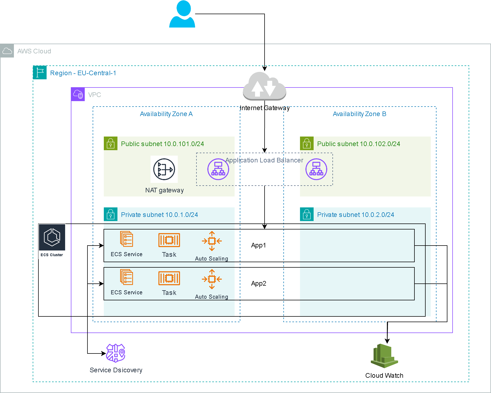

### Basic overview of services

- App1 is a RESTful API that receives a user-provided message, sends this message to App2, and then returns both the original and the processed message.
- App2 reverses the input text and returns both the original and modified messages.

### Cloud Infrastructure

For deploying this application on AWS, we will be using ECS which is a fully managed container orchestration service. CloudMap is a Service Discovery service enables service instances to be registered and discovered within a virtual private cloud.

### Walkthrough

#### 1. Creation of Python microservices
1. Created [App1](app1) using fastAPI, httpx and uvicorn modules. 
2. Created [App2](app2) using fastAPI and uvicorn modules.
3. Created requirements.txt and Dockerfile files for both microservices.
4. Created docker-compose.yml file to test the microservices.

#### 2. Setting up CI/CD using Gitlab
Created [.gitlab-ci.yml](.gitlab-ci.yml) file and defined the jobs to build docker images for both microservices on commits and merge requests. These docker images will be stored in the gitlab container registry.

#### 3. Creating AWS Infrastructure in AWS
Prerequisites
1. Installed Terraform.
2. Used aws cli to login to the AWS Account.
3. Created an S3 bucket and dynamodb table to store the terraform state file remotely.
4. Defined the [provider.tf](provider.tf) for AWS and configured to store the terraform state file remotely in S3.